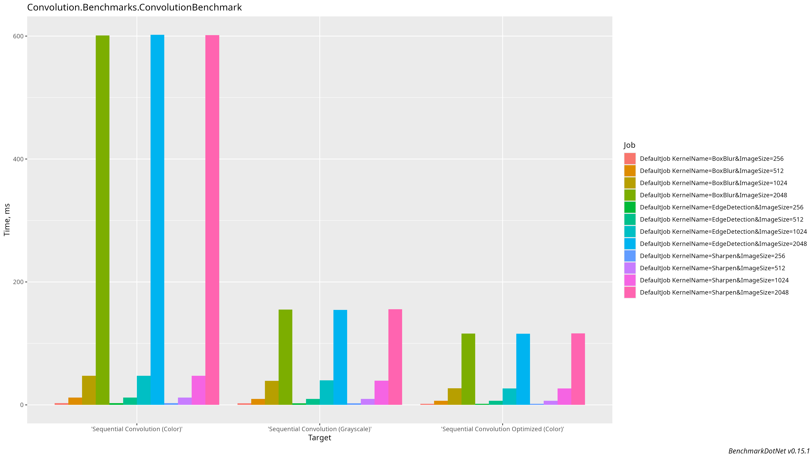
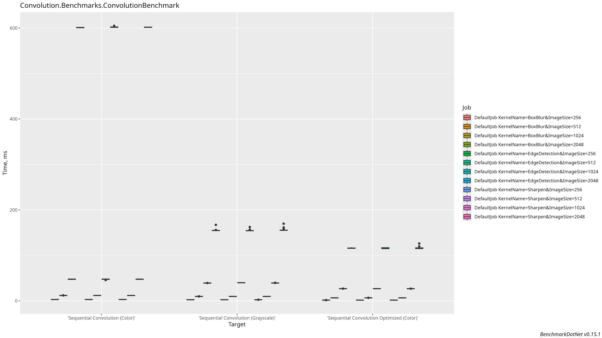

# C# Image Convolution

Алгоритм свёртки изображений на C# .NET. Выполнены и версия с цветом, и с градацией серого. В бенчмарке используются `Identity`, `EdgeDetection`, `Sharpen`, `BoxBlur`, но есть и `Zero`, `SobelX` и `SobelY` (для проверки ассиметричных), `Laplacian3x3`, `Laplacian5x5`. Для бенчмаркинга используется `BenchmarkDotNet`, для графиков его функциональность в генерации R кода. Для загрузки изображений `SixLabors`. Для тестов `Xunit` с покрытием кода от `coverlet` и `reportgenerator`. Проверяется полное соответствие изображений после свёртки с помощью библиотеки `Magick.NET`.

## Структура проекта

*   `src/Convolution.Main`: Реализация алгоритмов.
*   `src/Convolution.Cli`: CLI интерфейс для применения.
*   `src/Convolution.Benchmark`: Бенчмарк.
*   `tests/Convolution.Tests`: Модульные тесты для проверки корректности.

## Сборка и запуск

### Предварительные требования

1.  **.NET 9 SDK:** Требуется для сборки и запуска проекта.
2.  **R Language:** Необходимо для генерации графиков производительности.
    *   **Установка на Ubuntu:** `sudo apt-get install r-base`
3.  **.NET Tools:** Используются локальные .NET tools. Нужно запустить:

```bash
dotnet tool restore
```

Остальные Dependency скачиваются при запуске с помощью NuGet.

### Запуск CLI

Для обработки изображения используется версия свёртки с цветом `Rgb24`:

```bash
dotnet run --project src/Convolution.Cli -- -i yourpath/input.jpg -o yourpath/output.jpg -k Sharpen
```

Доступные ядра: `Identity`, `EdgeDetection`, `Sharpen`, `BoxBlur`, `Zero`, `SobelX`, `SobelY`, `Laplacian3x3`, `Laplacian5x5`

### Запуск тестов

Для запуска модульных тестов:

```bash
dotnet test
```

### Сгенерировать Coverage Report

Чтобы увидеть покрытие кода, запустите bash скрипт:

```bash
./create_coverage_report.sh
```

Так как использутся reportgenerator, до этого нужно запустить:
```bash
dotnet tool restore
```

## Анализ производительности

Анализ производительности проводился для последовательной реализации на изображениях в градациях серого (`L8`) и в цвете (`Rgb24`).

### Среда тестирования

**Аппаратное обеспечение:**
*   **CPU:** 12th Gen Intel Core i7-12700H
*   **Архитектура:** Гибридная (Alder Lake)
    *   **6 P-ядер (Performance):** 12 потоков.
    *   **8 E-ядер (Efficient):** 8 потоков.
    *   **Всего:** 14 ядер, 20 потоков.
*   **Кэш-память:**
    *   **L1 Data (на P-ядро):** 48 КиБ
    *   **L1 Instruction (на P-ядро):** 32 КиБ
    *   **L2 (на P-ядро):** 1280 КиБ
    *   **L2 (на кластер из 4 E-ядер):** 2048 КиБ
    *   **L3 (общий):** 24576 КиБ

**Программное обеспечение:**
*   **ОС:** Linux Ubuntu 24.04.2 LTS
*   **.NET:** .NET 9.0.6

**Условия проведения:**
*   Браузер, телеграм, фоновые приложение закрыты
*   Запуск через `sudo` для выставления бенчмарком высшего приоритета
*   Режим энергопитания: "Производительность"
*   Охлаждающая подставка Llano V12, 14 сантиметровый вентилятор, 2800 RPM, уплотнитель из поролона (~10% в скорости даже в таком последовательном режиме)

### Запуск бенчмарков

Для запуска бенчмарков:

```bash
sudo dotnet run --project src/Convolution.Benchmark -c Release
```

### Сгенерировать графики после бенчмарка:

Для детальных автоматических графиков (нужен язык R, остальные зависимости должны подтянуться):

```bash
Rscript ./BenchmarkDotNet.Artifacts/BuildPlots.R
```

### Результаты измерений

Ниже представлена таблица результатов для последовательной свёртки. Включены три метода: обычный для Grayscale, обычный для Color и оптимизированный для Color.




| Метод                                | Ядро          | Размер    | Среднее время | Соотношение (vs Grayscale) |
|:-------------------------------------|:--------------|:----------|--------------:|:---------------------------|
| **Grayscale**                        | BoxBlur       | 256x256   |      2.45 ms  | **1.00x**                  |
| Color                                | BoxBlur       | 256x256   |      2.97 ms  | **1.21x**                  |
| Color (Optimized)                    | BoxBlur       | 256x256   |      1.66 ms  | **0.68x**                  |
| **Grayscale**                        | BoxBlur       | 512x512   |      9.80 ms  | **1.00x**                  |
| Color                                | BoxBlur       | 512x512   |     11.92 ms  | **1.22x**                  |
| Color (Optimized)                    | BoxBlur       | 512x512   |      6.65 ms  | **0.68x**                  |
| **Grayscale**                        | BoxBlur       | 1024x1024 |     39.19 ms  | **1.00x**                  |
| Color                                | BoxBlur       | 1024x1024 |     47.33 ms  | **1.21x**                  |
| Color (Optimized)                    | BoxBlur       | 1024x1024 |     26.90 ms  | **0.69x**                  |
| **Grayscale**                        | BoxBlur       | 2048x2048 |    155.08 ms  | **1.00x**                  |
| Color                                | BoxBlur       | 2048x2048 |    600.88 ms  | **3.87x**                  |
| Color (Optimized)                    | BoxBlur       | 2048x2048 |    115.93 ms  | **0.75x**                  |
| **Grayscale**                        | EdgeDetection | 256x256   |      2.44 ms  | **1.00x**                  |
| Color                                | EdgeDetection | 256x256   |      2.97 ms  | **1.22x**                  |
| Color (Optimized)                    | EdgeDetection | 256x256   |      1.66 ms  | **0.68x**                  |
| **Grayscale**                        | EdgeDetection | 512x512   |      9.77 ms  | **1.00x**                  |
| Color                                | EdgeDetection | 512x512   |     11.89 ms  | **1.22x**                  |
| Color (Optimized)                    | EdgeDetection | 512x512   |      6.66 ms  | **0.68x**                  |
| **Grayscale**                        | EdgeDetection | 1024x1024 |     39.93 ms  | **1.00x**                  |
| Color                                | EdgeDetection | 1024x1024 |     47.35 ms  | **1.19x**                  |
| Color (Optimized)                    | EdgeDetection | 1024x1024 |     26.89 ms  | **0.67x**                  |
| **Grayscale**                        | EdgeDetection | 2048x2048 |    154.58 ms  | **1.00x**                  |
| Color                                | EdgeDetection | 2048x2048 |    602.07 ms  | **3.90x**                  |
| Color (Optimized)                    | EdgeDetection | 2048x2048 |    115.86 ms  | **0.75x**                  |
| **Grayscale**                        | Sharpen       | 256x256   |      2.44 ms  | **1.00x**                  |
| Color                                | Sharpen       | 256x256   |      2.96 ms  | **1.21x**                  |
| Color (Optimized)                    | Sharpen       | 256x256   |      1.66 ms  | **0.68x**                  |
| **Grayscale**                        | Sharpen       | 512x512   |      9.78 ms  | **1.00x**                  |
| Color                                | Sharpen       | 512x512   |     11.88 ms  | **1.21x**                  |
| Color (Optimized)                    | Sharpen       | 512x512   |      6.65 ms  | **0.68x**                  |
| **Grayscale**                        | Sharpen       | 1024x1024 |     39.30 ms  | **1.00x**                  |
| Color                                | Sharpen       | 1024x1024 |     47.39 ms  | **1.21x**                  |
| Color (Optimized)                    | Sharpen       | 1024x1024 |     26.82 ms  | **0.68x**                  |
| **Grayscale**                        | Sharpen       | 2048x2048 |    155.71 ms  | **1.00x**                  |
| Color                                | Sharpen       | 2048x2048 |    601.70 ms  | **3.86x**                  |
| Color (Optimized)                    | Sharpen       | 2048x2048 |    116.41 ms  | **0.75x**                  |

---

### Анализ №1: Масштабируемость и влияние размера изображения

Данные демонстрируют закономерность: время выполнения растет пропорционально количеству пикселей. Возьмем для примера обычную реализацию для Grayscale с ядром Sharpen.

*   **Переход 256 -> 512 (в 4 раза больше пикселей):** `9.78 ms / 2.44 ms = 4.01x`
*   **Переход 512 -> 1024 (в 4 раза больше пикселей):** `39.30 ms / 9.78 ms = 4.02x`
*   **Переход 1024 -> 2048 (в 4 раза больше пикселей):** `155.71 ms / 39.30 ms = 3.96x`

**Вывод:** Время выполнения почти идеально соответствует увеличению объема данных (`4x`). Подтверждается сложность `O(Width * Height)`. Алгоритм **compute-bound**.

---

### Анализ №2: Эффекты кэш-памяти при обработке цветных изображений

При сравнении обработки изображений в градациях серого (`L8`) и цветных (`Rgb24`) ключевым фактором, влияющим на производительность, становится кэш-память.

Обработка цветного изображения `Rgb24` требует применения ядра к каждому из трех цветовых каналов независимо. Для каждого пикселя выполняется в 3 раза больше арифметических операций, и объем данных также в 3 раза больше.

#### Практические результаты и их объяснение

| Размер    | Объем данных (Gray) | Объем данных (Color) | Соотношение (Color/Gray) | Анализ производительности |
|:----------|:--------------------|:---------------------|:-------------------------|:--------------------------|
| 256x256   | 64 КиБ              | 192 КиБ              | **~1.21x**               | - **Полностью в L2 кэше:** Данные исходного и результирующего цветных изображений (`384 КиБ`) полностью помещаются в L2 кэш P-ядра (`1.25МиБ`).<br>- **ILP (Instruction-Level Parallelism):** Независимые операции для каналов R, G, B выполняются параллельно на конвейере процессора, почти полностью скрывая 3-кратный рост вычислений. |
| 512x512   | 256 КиБ             | 768 КиБ              | **~1.22x**               | - **В L3 кэше:** Данные (`1.5 МиБ`) уже не помещаются в L2, но легко помещаются в общем L3 кэше (`24 МиБ`). Промахи L2->L3 очень быстры. Замедления не происходит. |
| 1024x1024 | 1 МиБ               | 3 МиБ                | **~1.21x**               | - **Все еще в L3:** Данные (`6 МиБ`) умещаются в L3 кэше. Замедления не происходит. |
| 2048x2048 | 4 МиБ               | 12 МиБ               | **~3.87x**               | - **Вытеснение из L3:** Общий объем данных (`24 МиБ`) **полностью заполняет L3 кэш**. Случайные обращения к пикселям `sourceImage` приводят к постоянным промахам L3->RAM, так как данные `sourceImage` и `resultImage` вытесняют друг друга (которые ещё конкурируют с данными системных процессов). Алгоритм становится **memory-bound**. |

### Общие выводы

1.  **Сложность:** Последовательная реализация демонстрирует ожидаемую `O(N)` сложность, где N - общее число пикселей, но только до тех пор, пока данные умещаются в быстрых уровнях кэш-памяти.
2.  **Память - bottleneck:** При увеличении объема обрабатываемых данных bottleneck становится не скорость вычислений, а пропускная способность и задержка памяти.
3.  **Нелинейная деградация:** Эффекты от кэш-промахов вызывают резкую нелинейную деградацию производительности, что наглядно демонстрирует скачок с `~1.2x` до `~3.9x` при переходе к размеру 2048x2048.

---

### Анализ №3: Эффективность кэш-оптимизированного подхода

Для проверки гипотезы о том, что bottleneck - это память, была реализована оптимизированная версия алгоритма для цветных изображений (`ApplyOptimized`). Главная идея оптимизации - минимизировать количество обращений к большому исходному изображению.

**Как это работает:**
1.  **Локализация вычислений:** Вместо всего изображения, в небольшой буфер (`rowBuffer`) загружается только несколько строк, необходимых для вычисления одной строки результата. Размер `rowBuffer` (для ядра 3x3 на изображении 2048px ~18 КБ) позволяет ему полностью разместиться в сверхбыстром **L1 кэше** процессора. Все интенсивные вычисления происходят исключительно с этим буфером.
2.  **Предсказуемый доступ к данным:** Доступ к большому `sourceImage` сводится к одному последовательному чтению новой строки после обработки каждой строки результата. Такой предсказуемый паттерн позволяет аппаратному предсказателю (prefetcher) процессора эффективно подгружать данные из RAM в кэш, скрывая задержки памяти.

#### Сравнительные результаты производительности

Сравним производительность наивной и оптимизированной версий на примере цветного изображения 2048x2048 с ядром BoxBlur.

| Метод (ядро BoxBlur, 2048x2048)            | Среднее время | Отношение к Grayscale | **Ускорение (Optimized vs Naive)** |
|:-------------------------------------------|--------------:|:----------------------|:-----------------------------------|
| Sequential Convolution (Grayscale)         |    155.08 ms  | **1.00x**             | -                            |
| Sequential Convolution (Color)             |    600.88 ms  | **3.87x**             | **1.00x**                    |
| **Sequential Convolution (Color, Optimized)** | **115.93 ms** | **0.75x**             | **5.18x**                 |

**Вывод:**
1.  **Устранение bottleneck:** Оптимизированный алгоритм выполняется почти в **5.2 раза** быстрее, чем наивная реализация. Это доказывает, что именно неэффективный доступ к памяти был основной причиной деградации производительности.
2.  **Быстрее, чем Grayscale:** Оптимизированная версия для цветных изображений (`115.93 ms`) оказалась даже на **25% быстрее**, чем наивная реализация для изображений в градациях серого (`155.08 ms`). Штраф за неэффективный доступ к памяти в наивной реализации оказался значительно выше, чем выигрыш от обработки только одного канала.

#### Анализ масштабируемости оптимизированного метода

Теперь проанализируем, как масштабируется сам оптимизированный метод (`BoxBlur`) при увеличении размера изображения в 4 раза.

*   **256 -> 512:** `6.65 ms / 1.66 ms = 4.01x`
*   **512 -> 1024:** `26.90 ms / 6.65 ms = 4.05x`
*   **1024 -> 2048:** `115.93 ms / 26.90 ms = 4.31x`

Оптимизированный метод демонстрирует почти идеальную линейную масштабируемость `O(N)`, даже на больших размерах изображений, так как он эффективно использует кэш и не упирается в пропускную способность оперативной памяти.

### Итоговый вывод

**Практическая ценность:** Написание кода, который учитывает архитектуру кэш-памяти процессора и паттерны доступа к данным, является необходимым условием для создания высокопроизводительных алгоритмов для работы с большими объемами данных.

Параллельные алгоритмы мы будем строить на основе **оптимизированной** версии и сравнивать её с ней.

# Вывод бенчмарка
```
// Benchmark Process 196722 has exited with code 0.

Mean = 116.408 ms, StdErr = 0.582 ms (0.50%), N = 20, StdDev = 2.604 ms
Min = 114.878 ms, Q1 = 114.954 ms, Median = 115.312 ms, Q3 = 116.868 ms, Max = 126.105 ms
IQR = 1.914 ms, LowerFence = 112.082 ms, UpperFence = 119.740 ms
ConfidenceInterval = [114.147 ms; 118.669 ms] (CI 99.9%), Margin = 2.261 ms (1.94% of Mean)
Skewness = 2.6, Kurtosis = 9.8, MValue = 2

// ** Remained 0 (0.0%) benchmark(s) to run. Estimated finish 2025-07-02 22:31 (0h 0m from now) **
// ***** BenchmarkRunner: Finish  *****

// * Export *
  BenchmarkDotNet.Artifacts/results/Convolution.Benchmarks.ConvolutionBenchmark-report.csv
  BenchmarkDotNet.Artifacts/results/Convolution.Benchmarks.ConvolutionBenchmark-report-github.md
  BenchmarkDotNet.Artifacts/results/Convolution.Benchmarks.ConvolutionBenchmark-report.html
  BenchmarkDotNet.Artifacts/results/Convolution.Benchmarks.ConvolutionBenchmark-measurements.csv
  BenchmarkDotNet.Artifacts/results/BuildPlots.R
  BenchmarkDotNet.Artifacts/results/*.png

// * Detailed results *
ConvolutionBenchmark.'Sequential Convolution (Grayscale)': DefaultJob [KernelName=BoxBlur, ImageSize=256]
Runtime = .NET 9.0.6 (9.0.625.26613), X64 RyuJIT AVX2; GC = Concurrent Workstation
Mean = 2.445 ms, StdErr = 0.001 ms (0.03%), N = 13, StdDev = 0.003 ms
Min = 2.440 ms, Q1 = 2.443 ms, Median = 2.445 ms, Q3 = 2.446 ms, Max = 2.450 ms
IQR = 0.003 ms, LowerFence = 2.439 ms, UpperFence = 2.451 ms
ConfidenceInterval = [2.441 ms; 2.448 ms] (CI 99.9%), Margin = 0.003 ms (0.14% of Mean)
Skewness = 0.16, Kurtosis = 2.25, MValue = 2
-------------------- Histogram --------------------
[2.438 ms ; 2.452 ms) | @@@@@@@@@@@@@
---------------------------------------------------

ConvolutionBenchmark.'Sequential Convolution (Color)': DefaultJob [KernelName=BoxBlur, ImageSize=256]
Runtime = .NET 9.0.6 (9.0.625.26613), X64 RyuJIT AVX2; GC = Concurrent Workstation
Mean = 2.966 ms, StdErr = 0.001 ms (0.05%), N = 14, StdDev = 0.005 ms
Min = 2.960 ms, Q1 = 2.962 ms, Median = 2.965 ms, Q3 = 2.969 ms, Max = 2.977 ms
IQR = 0.007 ms, LowerFence = 2.951 ms, UpperFence = 2.980 ms
ConfidenceInterval = [2.960 ms; 2.972 ms] (CI 99.9%), Margin = 0.006 ms (0.20% of Mean)
Skewness = 0.67, Kurtosis = 2.07, MValue = 2
-------------------- Histogram --------------------
[2.957 ms ; 2.980 ms) | @@@@@@@@@@@@@@
---------------------------------------------------

ConvolutionBenchmark.'Sequential Convolution Optimized (Color)': DefaultJob [KernelName=BoxBlur, ImageSize=256]
Runtime = .NET 9.0.6 (9.0.625.26613), X64 RyuJIT AVX2; GC = Concurrent Workstation
Mean = 1.660 ms, StdErr = 0.000 ms (0.02%), N = 12, StdDev = 0.001 ms
Min = 1.657 ms, Q1 = 1.659 ms, Median = 1.660 ms, Q3 = 1.661 ms, Max = 1.662 ms
IQR = 0.001 ms, LowerFence = 1.657 ms, UpperFence = 1.662 ms
ConfidenceInterval = [1.658 ms; 1.661 ms] (CI 99.9%), Margin = 0.001 ms (0.09% of Mean)
Skewness = -0.54, Kurtosis = 2.53, MValue = 2
-------------------- Histogram --------------------
[1.657 ms ; 1.662 ms) | @@@@@@@@@@@@
---------------------------------------------------

ConvolutionBenchmark.'Sequential Convolution (Grayscale)': DefaultJob [KernelName=BoxBlur, ImageSize=512]
Runtime = .NET 9.0.6 (9.0.625.26613), X64 RyuJIT AVX2; GC = Concurrent Workstation
Mean = 9.797 ms, StdErr = 0.010 ms (0.11%), N = 13, StdDev = 0.037 ms
Min = 9.764 ms, Q1 = 9.778 ms, Median = 9.783 ms, Q3 = 9.800 ms, Max = 9.898 ms
IQR = 0.023 ms, LowerFence = 9.744 ms, UpperFence = 9.834 ms
ConfidenceInterval = [9.753 ms; 9.842 ms] (CI 99.9%), Margin = 0.045 ms (0.46% of Mean)
Skewness = 1.53, Kurtosis = 4.36, MValue = 2
-------------------- Histogram --------------------
[9.743 ms ; 9.919 ms) | @@@@@@@@@@@@@
---------------------------------------------------

ConvolutionBenchmark.'Sequential Convolution (Color)': DefaultJob [KernelName=BoxBlur, ImageSize=512]
Runtime = .NET 9.0.6 (9.0.625.26613), X64 RyuJIT AVX2; GC = Concurrent Workstation
Mean = 11.919 ms, StdErr = 0.017 ms (0.14%), N = 14, StdDev = 0.063 ms
Min = 11.858 ms, Q1 = 11.880 ms, Median = 11.895 ms, Q3 = 11.931 ms, Max = 12.066 ms
IQR = 0.051 ms, LowerFence = 11.804 ms, UpperFence = 12.007 ms
ConfidenceInterval = [11.847 ms; 11.990 ms] (CI 99.9%), Margin = 0.071 ms (0.60% of Mean)
Skewness = 1.11, Kurtosis = 2.79, MValue = 2
-------------------- Histogram --------------------
[11.824 ms ; 12.100 ms) | @@@@@@@@@@@@@@
---------------------------------------------------

ConvolutionBenchmark.'Sequential Convolution Optimized (Color)': DefaultJob [KernelName=BoxBlur, ImageSize=512]
Runtime = .NET 9.0.6 (9.0.625.26613), X64 RyuJIT AVX2; GC = Concurrent Workstation
Mean = 6.645 ms, StdErr = 0.001 ms (0.02%), N = 14, StdDev = 0.005 ms
Min = 6.635 ms, Q1 = 6.642 ms, Median = 6.645 ms, Q3 = 6.650 ms, Max = 6.655 ms
IQR = 0.008 ms, LowerFence = 6.629 ms, UpperFence = 6.663 ms
ConfidenceInterval = [6.639 ms; 6.652 ms] (CI 99.9%), Margin = 0.006 ms (0.09% of Mean)
Skewness = -0.1, Kurtosis = 1.85, MValue = 2
-------------------- Histogram --------------------
[6.632 ms ; 6.658 ms) | @@@@@@@@@@@@@@
---------------------------------------------------

ConvolutionBenchmark.'Sequential Convolution (Grayscale)': DefaultJob [KernelName=BoxBlur, ImageSize=1024]
Runtime = .NET 9.0.6 (9.0.625.26613), X64 RyuJIT AVX2; GC = Concurrent Workstation
Mean = 39.193 ms, StdErr = 0.018 ms (0.05%), N = 14, StdDev = 0.067 ms
Min = 39.092 ms, Q1 = 39.162 ms, Median = 39.177 ms, Q3 = 39.231 ms, Max = 39.354 ms
IQR = 0.069 ms, LowerFence = 39.058 ms, UpperFence = 39.335 ms
ConfidenceInterval = [39.117 ms; 39.270 ms] (CI 99.9%), Margin = 0.076 ms (0.19% of Mean)
Skewness = 0.63, Kurtosis = 3.04, MValue = 2
-------------------- Histogram --------------------
[39.055 ms ; 39.390 ms) | @@@@@@@@@@@@@@
---------------------------------------------------

ConvolutionBenchmark.'Sequential Convolution (Color)': DefaultJob [KernelName=BoxBlur, ImageSize=1024]
Runtime = .NET 9.0.6 (9.0.625.26613), X64 RyuJIT AVX2; GC = Concurrent Workstation
Mean = 47.331 ms, StdErr = 0.202 ms (0.43%), N = 15, StdDev = 0.783 ms
Min = 45.752 ms, Q1 = 46.980 ms, Median = 47.744 ms, Q3 = 47.824 ms, Max = 47.906 ms
IQR = 0.844 ms, LowerFence = 45.715 ms, UpperFence = 49.089 ms
ConfidenceInterval = [46.494 ms; 48.168 ms] (CI 99.9%), Margin = 0.837 ms (1.77% of Mean)
Skewness = -1.02, Kurtosis = 2.16, MValue = 2
-------------------- Histogram --------------------
[45.594 ms ; 48.233 ms) | @@@@@@@@@@@@@@@
---------------------------------------------------

ConvolutionBenchmark.'Sequential Convolution Optimized (Color)': DefaultJob [KernelName=BoxBlur, ImageSize=1024]
Runtime = .NET 9.0.6 (9.0.625.26613), X64 RyuJIT AVX2; GC = Concurrent Workstation
Mean = 26.902 ms, StdErr = 0.009 ms (0.04%), N = 14, StdDev = 0.035 ms
Min = 26.859 ms, Q1 = 26.878 ms, Median = 26.893 ms, Q3 = 26.915 ms, Max = 26.974 ms
IQR = 0.037 ms, LowerFence = 26.822 ms, UpperFence = 26.971 ms
ConfidenceInterval = [26.862 ms; 26.942 ms] (CI 99.9%), Margin = 0.040 ms (0.15% of Mean)
Skewness = 0.84, Kurtosis = 2.54, MValue = 2
-------------------- Histogram --------------------
[26.840 ms ; 26.993 ms) | @@@@@@@@@@@@@@
---------------------------------------------------

ConvolutionBenchmark.'Sequential Convolution (Grayscale)': DefaultJob [KernelName=BoxBlur, ImageSize=2048]
Runtime = .NET 9.0.6 (9.0.625.26613), X64 RyuJIT AVX2; GC = Concurrent Workstation
Mean = 155.078 ms, StdErr = 0.293 ms (0.19%), N = 43, StdDev = 1.922 ms
Min = 154.238 ms, Q1 = 154.526 ms, Median = 154.729 ms, Q3 = 154.994 ms, Max = 167.162 ms
IQR = 0.468 ms, LowerFence = 153.823 ms, UpperFence = 155.696 ms
ConfidenceInterval = [154.041 ms; 156.115 ms] (CI 99.9%), Margin = 1.037 ms (0.67% of Mean)
Skewness = 5.77, Kurtosis = 36.36, MValue = 2
-------------------- Histogram --------------------
[153.518 ms ; 157.945 ms) | @@@@@@@@@@@@@@@@@@@@@@@@@@@@@@@@@@@@@@@@@@
[157.945 ms ; 162.264 ms) | 
[162.264 ms ; 167.882 ms) | @
---------------------------------------------------

ConvolutionBenchmark.'Sequential Convolution (Color)': DefaultJob [KernelName=BoxBlur, ImageSize=2048]
Runtime = .NET 9.0.6 (9.0.625.26613), X64 RyuJIT AVX2; GC = Concurrent Workstation
Mean = 600.884 ms, StdErr = 0.210 ms (0.03%), N = 14, StdDev = 0.786 ms
Min = 599.749 ms, Q1 = 600.246 ms, Median = 600.954 ms, Q3 = 601.592 ms, Max = 602.189 ms
IQR = 1.345 ms, LowerFence = 598.228 ms, UpperFence = 603.610 ms
ConfidenceInterval = [599.997 ms; 601.770 ms] (CI 99.9%), Margin = 0.886 ms (0.15% of Mean)
Skewness = -0.01, Kurtosis = 1.46, MValue = 2
-------------------- Histogram --------------------
[599.321 ms ; 602.617 ms) | @@@@@@@@@@@@@@
---------------------------------------------------

ConvolutionBenchmark.'Sequential Convolution Optimized (Color)': DefaultJob [KernelName=BoxBlur, ImageSize=2048]
Runtime = .NET 9.0.6 (9.0.625.26613), X64 RyuJIT AVX2; GC = Concurrent Workstation
Mean = 115.934 ms, StdErr = 0.212 ms (0.18%), N = 19, StdDev = 0.923 ms
Min = 114.739 ms, Q1 = 115.182 ms, Median = 115.810 ms, Q3 = 116.580 ms, Max = 117.924 ms
IQR = 1.398 ms, LowerFence = 113.085 ms, UpperFence = 118.677 ms
ConfidenceInterval = [115.104 ms; 116.764 ms] (CI 99.9%), Margin = 0.830 ms (0.72% of Mean)
Skewness = 0.4, Kurtosis = 1.94, MValue = 2
-------------------- Histogram --------------------
[114.285 ms ; 118.378 ms) | @@@@@@@@@@@@@@@@@@@
---------------------------------------------------

ConvolutionBenchmark.'Sequential Convolution (Grayscale)': DefaultJob [KernelName=EdgeDetection, ImageSize=256]
Runtime = .NET 9.0.6 (9.0.625.26613), X64 RyuJIT AVX2; GC = Concurrent Workstation
Mean = 2.442 ms, StdErr = 0.001 ms (0.03%), N = 14, StdDev = 0.003 ms
Min = 2.437 ms, Q1 = 2.440 ms, Median = 2.441 ms, Q3 = 2.444 ms, Max = 2.448 ms
IQR = 0.004 ms, LowerFence = 2.434 ms, UpperFence = 2.451 ms
ConfidenceInterval = [2.439 ms; 2.446 ms] (CI 99.9%), Margin = 0.003 ms (0.14% of Mean)
Skewness = 0.12, Kurtosis = 1.8, MValue = 2
-------------------- Histogram --------------------
[2.435 ms ; 2.449 ms) | @@@@@@@@@@@@@@
---------------------------------------------------

ConvolutionBenchmark.'Sequential Convolution (Color)': DefaultJob [KernelName=EdgeDetection, ImageSize=256]
Runtime = .NET 9.0.6 (9.0.625.26613), X64 RyuJIT AVX2; GC = Concurrent Workstation
Mean = 2.966 ms, StdErr = 0.001 ms (0.03%), N = 14, StdDev = 0.003 ms
Min = 2.961 ms, Q1 = 2.964 ms, Median = 2.966 ms, Q3 = 2.968 ms, Max = 2.971 ms
IQR = 0.004 ms, LowerFence = 2.959 ms, UpperFence = 2.973 ms
ConfidenceInterval = [2.962 ms; 2.969 ms] (CI 99.9%), Margin = 0.003 ms (0.12% of Mean)
Skewness = -0.01, Kurtosis = 1.77, MValue = 2
-------------------- Histogram --------------------
[2.959 ms ; 2.972 ms) | @@@@@@@@@@@@@@
---------------------------------------------------

ConvolutionBenchmark.'Sequential Convolution Optimized (Color)': DefaultJob [KernelName=EdgeDetection, ImageSize=256]
Runtime = .NET 9.0.6 (9.0.625.26613), X64 RyuJIT AVX2; GC = Concurrent Workstation
Mean = 1.663 ms, StdErr = 0.000 ms (0.02%), N = 13, StdDev = 0.001 ms
Min = 1.661 ms, Q1 = 1.662 ms, Median = 1.663 ms, Q3 = 1.664 ms, Max = 1.665 ms
IQR = 0.001 ms, LowerFence = 1.660 ms, UpperFence = 1.665 ms
ConfidenceInterval = [1.661 ms; 1.664 ms] (CI 99.9%), Margin = 0.002 ms (0.09% of Mean)
Skewness = -0.05, Kurtosis = 2.09, MValue = 2
-------------------- Histogram --------------------
[1.660 ms ; 1.666 ms) | @@@@@@@@@@@@@
---------------------------------------------------

ConvolutionBenchmark.'Sequential Convolution (Grayscale)': DefaultJob [KernelName=EdgeDetection, ImageSize=512]
Runtime = .NET 9.0.6 (9.0.625.26613), X64 RyuJIT AVX2; GC = Concurrent Workstation
Mean = 9.765 ms, StdErr = 0.002 ms (0.02%), N = 12, StdDev = 0.006 ms
Min = 9.755 ms, Q1 = 9.760 ms, Median = 9.767 ms, Q3 = 9.770 ms, Max = 9.772 ms
IQR = 0.011 ms, LowerFence = 9.743 ms, UpperFence = 9.787 ms
ConfidenceInterval = [9.757 ms; 9.773 ms] (CI 99.9%), Margin = 0.008 ms (0.08% of Mean)
Skewness = -0.25, Kurtosis = 1.25, MValue = 2
-------------------- Histogram --------------------
[9.751 ms ; 9.776 ms) | @@@@@@@@@@@@
---------------------------------------------------

ConvolutionBenchmark.'Sequential Convolution (Color)': DefaultJob [KernelName=EdgeDetection, ImageSize=512]
Runtime = .NET 9.0.6 (9.0.625.26613), X64 RyuJIT AVX2; GC = Concurrent Workstation
Mean = 11.892 ms, StdErr = 0.003 ms (0.03%), N = 14, StdDev = 0.013 ms
Min = 11.873 ms, Q1 = 11.885 ms, Median = 11.894 ms, Q3 = 11.901 ms, Max = 11.919 ms
IQR = 0.016 ms, LowerFence = 11.861 ms, UpperFence = 11.925 ms
ConfidenceInterval = [11.878 ms; 11.907 ms] (CI 99.9%), Margin = 0.014 ms (0.12% of Mean)
Skewness = 0.19, Kurtosis = 2.27, MValue = 2
-------------------- Histogram --------------------
[11.866 ms ; 11.926 ms) | @@@@@@@@@@@@@@
---------------------------------------------------

ConvolutionBenchmark.'Sequential Convolution Optimized (Color)': DefaultJob [KernelName=EdgeDetection, ImageSize=512]
Runtime = .NET 9.0.6 (9.0.625.26613), X64 RyuJIT AVX2; GC = Concurrent Workstation
Mean = 6.663 ms, StdErr = 0.002 ms (0.03%), N = 13, StdDev = 0.008 ms
Min = 6.653 ms, Q1 = 6.658 ms, Median = 6.662 ms, Q3 = 6.665 ms, Max = 6.681 ms
IQR = 0.007 ms, LowerFence = 6.647 ms, UpperFence = 6.675 ms
ConfidenceInterval = [6.654 ms; 6.673 ms] (CI 99.9%), Margin = 0.009 ms (0.14% of Mean)
Skewness = 0.81, Kurtosis = 2.71, MValue = 2
-------------------- Histogram --------------------
[6.649 ms ; 6.686 ms) | @@@@@@@@@@@@@
---------------------------------------------------

ConvolutionBenchmark.'Sequential Convolution (Grayscale)': DefaultJob [KernelName=EdgeDetection, ImageSize=1024]
Runtime = .NET 9.0.6 (9.0.625.26613), X64 RyuJIT AVX2; GC = Concurrent Workstation
Mean = 39.932 ms, StdErr = 0.018 ms (0.05%), N = 15, StdDev = 0.071 ms
Min = 39.777 ms, Q1 = 39.886 ms, Median = 39.924 ms, Q3 = 39.969 ms, Max = 40.070 ms
IQR = 0.083 ms, LowerFence = 39.761 ms, UpperFence = 40.094 ms
ConfidenceInterval = [39.856 ms; 40.008 ms] (CI 99.9%), Margin = 0.076 ms (0.19% of Mean)
Skewness = -0.19, Kurtosis = 2.69, MValue = 2
-------------------- Histogram --------------------
[39.739 ms ; 40.108 ms) | @@@@@@@@@@@@@@@
---------------------------------------------------

ConvolutionBenchmark.'Sequential Convolution (Color)': DefaultJob [KernelName=EdgeDetection, ImageSize=1024]
Runtime = .NET 9.0.6 (9.0.625.26613), X64 RyuJIT AVX2; GC = Concurrent Workstation
Mean = 47.345 ms, StdErr = 0.213 ms (0.45%), N = 15, StdDev = 0.825 ms
Min = 45.682 ms, Q1 = 47.009 ms, Median = 47.751 ms, Q3 = 47.854 ms, Max = 47.981 ms
IQR = 0.845 ms, LowerFence = 45.742 ms, UpperFence = 49.121 ms
ConfidenceInterval = [46.464 ms; 48.227 ms] (CI 99.9%), Margin = 0.882 ms (1.86% of Mean)
Skewness = -1, Kurtosis = 2.09, MValue = 2
-------------------- Histogram --------------------
[45.547 ms ; 48.312 ms) | @@@@@@@@@@@@@@@
---------------------------------------------------

ConvolutionBenchmark.'Sequential Convolution Optimized (Color)': DefaultJob [KernelName=EdgeDetection, ImageSize=1024]
Runtime = .NET 9.0.6 (9.0.625.26613), X64 RyuJIT AVX2; GC = Concurrent Workstation
Mean = 26.886 ms, StdErr = 0.008 ms (0.03%), N = 15, StdDev = 0.033 ms
Min = 26.839 ms, Q1 = 26.863 ms, Median = 26.880 ms, Q3 = 26.912 ms, Max = 26.955 ms
IQR = 0.048 ms, LowerFence = 26.791 ms, UpperFence = 26.984 ms
ConfidenceInterval = [26.851 ms; 26.921 ms] (CI 99.9%), Margin = 0.035 ms (0.13% of Mean)
Skewness = 0.37, Kurtosis = 2.08, MValue = 2
-------------------- Histogram --------------------
[26.821 ms ; 26.972 ms) | @@@@@@@@@@@@@@@
---------------------------------------------------

ConvolutionBenchmark.'Sequential Convolution (Grayscale)': DefaultJob [KernelName=EdgeDetection, ImageSize=2048]
Runtime = .NET 9.0.6 (9.0.625.26613), X64 RyuJIT AVX2; GC = Concurrent Workstation
Mean = 154.583 ms, StdErr = 0.204 ms (0.13%), N = 43, StdDev = 1.339 ms
Min = 153.591 ms, Q1 = 154.039 ms, Median = 154.351 ms, Q3 = 154.680 ms, Max = 162.321 ms
IQR = 0.642 ms, LowerFence = 153.076 ms, UpperFence = 155.643 ms
ConfidenceInterval = [153.860 ms; 155.305 ms] (CI 99.9%), Margin = 0.723 ms (0.47% of Mean)
Skewness = 4.53, Kurtosis = 26.13, MValue = 2
-------------------- Histogram --------------------
[153.089 ms ; 158.332 ms) | @@@@@@@@@@@@@@@@@@@@@@@@@@@@@@@@@@@@@@@@@@
[158.332 ms ; 162.823 ms) | @
---------------------------------------------------

ConvolutionBenchmark.'Sequential Convolution (Color)': DefaultJob [KernelName=EdgeDetection, ImageSize=2048]
Runtime = .NET 9.0.6 (9.0.625.26613), X64 RyuJIT AVX2; GC = Concurrent Workstation
Mean = 602.072 ms, StdErr = 0.284 ms (0.05%), N = 14, StdDev = 1.064 ms
Min = 600.995 ms, Q1 = 601.451 ms, Median = 601.622 ms, Q3 = 602.579 ms, Max = 604.818 ms
IQR = 1.128 ms, LowerFence = 599.759 ms, UpperFence = 604.271 ms
ConfidenceInterval = [600.872 ms; 603.273 ms] (CI 99.9%), Margin = 1.200 ms (0.20% of Mean)
Skewness = 1.18, Kurtosis = 3.52, MValue = 2
-------------------- Histogram --------------------
[600.416 ms ; 605.398 ms) | @@@@@@@@@@@@@@
---------------------------------------------------

ConvolutionBenchmark.'Sequential Convolution Optimized (Color)': DefaultJob [KernelName=EdgeDetection, ImageSize=2048]
Runtime = .NET 9.0.6 (9.0.625.26613), X64 RyuJIT AVX2; GC = Concurrent Workstation
Mean = 115.864 ms, StdErr = 0.290 ms (0.25%), N = 19, StdDev = 1.264 ms
Min = 114.638 ms, Q1 = 114.844 ms, Median = 115.108 ms, Q3 = 117.184 ms, Max = 117.945 ms
IQR = 2.341 ms, LowerFence = 111.332 ms, UpperFence = 120.696 ms
ConfidenceInterval = [114.727 ms; 117.001 ms] (CI 99.9%), Margin = 1.137 ms (0.98% of Mean)
Skewness = 0.5, Kurtosis = 1.36, MValue = 2
-------------------- Histogram --------------------
[114.016 ms ; 118.567 ms) | @@@@@@@@@@@@@@@@@@@
---------------------------------------------------

ConvolutionBenchmark.'Sequential Convolution (Grayscale)': DefaultJob [KernelName=Sharpen, ImageSize=256]
Runtime = .NET 9.0.6 (9.0.625.26613), X64 RyuJIT AVX2; GC = Concurrent Workstation
Mean = 2.441 ms, StdErr = 0.002 ms (0.07%), N = 14, StdDev = 0.006 ms
Min = 2.435 ms, Q1 = 2.438 ms, Median = 2.438 ms, Q3 = 2.444 ms, Max = 2.458 ms
IQR = 0.006 ms, LowerFence = 2.428 ms, UpperFence = 2.454 ms
ConfidenceInterval = [2.434 ms; 2.449 ms] (CI 99.9%), Margin = 0.007 ms (0.30% of Mean)
Skewness = 1.21, Kurtosis = 3.61, MValue = 2
-------------------- Histogram --------------------
[2.432 ms ; 2.462 ms) | @@@@@@@@@@@@@@
---------------------------------------------------

ConvolutionBenchmark.'Sequential Convolution (Color)': DefaultJob [KernelName=Sharpen, ImageSize=256]
Runtime = .NET 9.0.6 (9.0.625.26613), X64 RyuJIT AVX2; GC = Concurrent Workstation
Mean = 2.964 ms, StdErr = 0.001 ms (0.02%), N = 14, StdDev = 0.003 ms
Min = 2.960 ms, Q1 = 2.962 ms, Median = 2.964 ms, Q3 = 2.966 ms, Max = 2.969 ms
IQR = 0.004 ms, LowerFence = 2.956 ms, UpperFence = 2.972 ms
ConfidenceInterval = [2.961 ms; 2.967 ms] (CI 99.9%), Margin = 0.003 ms (0.10% of Mean)
Skewness = 0.3, Kurtosis = 1.72, MValue = 2
-------------------- Histogram --------------------
[2.959 ms ; 2.970 ms) | @@@@@@@@@@@@@@
---------------------------------------------------

ConvolutionBenchmark.'Sequential Convolution Optimized (Color)': DefaultJob [KernelName=Sharpen, ImageSize=256]
Runtime = .NET 9.0.6 (9.0.625.26613), X64 RyuJIT AVX2; GC = Concurrent Workstation
Mean = 1.661 ms, StdErr = 0.000 ms (0.01%), N = 13, StdDev = 0.001 ms
Min = 1.659 ms, Q1 = 1.660 ms, Median = 1.661 ms, Q3 = 1.662 ms, Max = 1.662 ms
IQR = 0.001 ms, LowerFence = 1.659 ms, UpperFence = 1.663 ms
ConfidenceInterval = [1.660 ms; 1.662 ms] (CI 99.9%), Margin = 0.001 ms (0.06% of Mean)
Skewness = -0.37, Kurtosis = 2, MValue = 2
-------------------- Histogram --------------------
[1.659 ms ; 1.662 ms) | @@@@@@@@@@@@@
---------------------------------------------------

ConvolutionBenchmark.'Sequential Convolution (Grayscale)': DefaultJob [KernelName=Sharpen, ImageSize=512]
Runtime = .NET 9.0.6 (9.0.625.26613), X64 RyuJIT AVX2; GC = Concurrent Workstation
Mean = 9.784 ms, StdErr = 0.007 ms (0.07%), N = 15, StdDev = 0.025 ms
Min = 9.748 ms, Q1 = 9.764 ms, Median = 9.781 ms, Q3 = 9.797 ms, Max = 9.839 ms
IQR = 0.033 ms, LowerFence = 9.715 ms, UpperFence = 9.846 ms
ConfidenceInterval = [9.757 ms; 9.811 ms] (CI 99.9%), Margin = 0.027 ms (0.28% of Mean)
Skewness = 0.58, Kurtosis = 2.4, MValue = 2
-------------------- Histogram --------------------
[9.734 ms ; 9.852 ms) | @@@@@@@@@@@@@@@
---------------------------------------------------

ConvolutionBenchmark.'Sequential Convolution (Color)': DefaultJob [KernelName=Sharpen, ImageSize=512]
Runtime = .NET 9.0.6 (9.0.625.26613), X64 RyuJIT AVX2; GC = Concurrent Workstation
Mean = 11.884 ms, StdErr = 0.007 ms (0.06%), N = 14, StdDev = 0.026 ms
Min = 11.851 ms, Q1 = 11.868 ms, Median = 11.875 ms, Q3 = 11.900 ms, Max = 11.937 ms
IQR = 0.032 ms, LowerFence = 11.820 ms, UpperFence = 11.948 ms
ConfidenceInterval = [11.854 ms; 11.914 ms] (CI 99.9%), Margin = 0.030 ms (0.25% of Mean)
Skewness = 0.61, Kurtosis = 2.06, MValue = 2
-------------------- Histogram --------------------
[11.836 ms ; 11.951 ms) | @@@@@@@@@@@@@@
---------------------------------------------------

ConvolutionBenchmark.'Sequential Convolution Optimized (Color)': DefaultJob [KernelName=Sharpen, ImageSize=512]
Runtime = .NET 9.0.6 (9.0.625.26613), X64 RyuJIT AVX2; GC = Concurrent Workstation
Mean = 6.653 ms, StdErr = 0.002 ms (0.02%), N = 14, StdDev = 0.006 ms
Min = 6.646 ms, Q1 = 6.648 ms, Median = 6.651 ms, Q3 = 6.657 ms, Max = 6.665 ms
IQR = 0.009 ms, LowerFence = 6.635 ms, UpperFence = 6.670 ms
ConfidenceInterval = [6.646 ms; 6.660 ms] (CI 99.9%), Margin = 0.007 ms (0.10% of Mean)
Skewness = 0.65, Kurtosis = 1.99, MValue = 2
-------------------- Histogram --------------------
[6.642 ms ; 6.669 ms) | @@@@@@@@@@@@@@
---------------------------------------------------

ConvolutionBenchmark.'Sequential Convolution (Grayscale)': DefaultJob [KernelName=Sharpen, ImageSize=1024]
Runtime = .NET 9.0.6 (9.0.625.26613), X64 RyuJIT AVX2; GC = Concurrent Workstation
Mean = 39.301 ms, StdErr = 0.047 ms (0.12%), N = 13, StdDev = 0.170 ms
Min = 39.129 ms, Q1 = 39.191 ms, Median = 39.261 ms, Q3 = 39.304 ms, Max = 39.747 ms
IQR = 0.113 ms, LowerFence = 39.021 ms, UpperFence = 39.474 ms
ConfidenceInterval = [39.097 ms; 39.505 ms] (CI 99.9%), Margin = 0.204 ms (0.52% of Mean)
Skewness = 1.5, Kurtosis = 4.18, MValue = 2
-------------------- Histogram --------------------
[39.033 ms ; 39.842 ms) | @@@@@@@@@@@@@
---------------------------------------------------

ConvolutionBenchmark.'Sequential Convolution (Color)': DefaultJob [KernelName=Sharpen, ImageSize=1024]
Runtime = .NET 9.0.6 (9.0.625.26613), X64 RyuJIT AVX2; GC = Concurrent Workstation
Mean = 47.385 ms, StdErr = 0.185 ms (0.39%), N = 15, StdDev = 0.718 ms
Min = 45.910 ms, Q1 = 47.042 ms, Median = 47.713 ms, Q3 = 47.851 ms, Max = 48.051 ms
IQR = 0.809 ms, LowerFence = 45.829 ms, UpperFence = 49.064 ms
ConfidenceInterval = [46.617 ms; 48.153 ms] (CI 99.9%), Margin = 0.768 ms (1.62% of Mean)
Skewness = -0.96, Kurtosis = 2.1, MValue = 2
-------------------- Histogram --------------------
[45.710 ms ; 48.330 ms) | @@@@@@@@@@@@@@@
---------------------------------------------------

ConvolutionBenchmark.'Sequential Convolution Optimized (Color)': DefaultJob [KernelName=Sharpen, ImageSize=1024]
Runtime = .NET 9.0.6 (9.0.625.26613), X64 RyuJIT AVX2; GC = Concurrent Workstation
Mean = 26.821 ms, StdErr = 0.009 ms (0.04%), N = 14, StdDev = 0.035 ms
Min = 26.775 ms, Q1 = 26.801 ms, Median = 26.813 ms, Q3 = 26.838 ms, Max = 26.897 ms
IQR = 0.037 ms, LowerFence = 26.745 ms, UpperFence = 26.893 ms
ConfidenceInterval = [26.782 ms; 26.861 ms] (CI 99.9%), Margin = 0.040 ms (0.15% of Mean)
Skewness = 0.7, Kurtosis = 2.42, MValue = 2
-------------------- Histogram --------------------
[26.756 ms ; 26.916 ms) | @@@@@@@@@@@@@@
---------------------------------------------------

ConvolutionBenchmark.'Sequential Convolution (Grayscale)': DefaultJob [KernelName=Sharpen, ImageSize=2048]
Runtime = .NET 9.0.6 (9.0.625.26613), X64 RyuJIT AVX2; GC = Concurrent Workstation
Mean = 155.713 ms, StdErr = 0.379 ms (0.24%), N = 43, StdDev = 2.486 ms
Min = 153.993 ms, Q1 = 154.866 ms, Median = 155.388 ms, Q3 = 155.549 ms, Max = 169.704 ms
IQR = 0.683 ms, LowerFence = 153.841 ms, UpperFence = 156.573 ms
ConfidenceInterval = [154.371 ms; 157.054 ms] (CI 99.9%), Margin = 1.341 ms (0.86% of Mean)
Skewness = 4.43, Kurtosis = 24.09, MValue = 2
-------------------- Histogram --------------------
[153.344 ms ; 159.661 ms) | @@@@@@@@@@@@@@@@@@@@@@@@@@@@@@@@@@@@@@@@@
[159.661 ms ; 163.188 ms) | @
[163.188 ms ; 170.636 ms) | @
---------------------------------------------------

ConvolutionBenchmark.'Sequential Convolution (Color)': DefaultJob [KernelName=Sharpen, ImageSize=2048]
Runtime = .NET 9.0.6 (9.0.625.26613), X64 RyuJIT AVX2; GC = Concurrent Workstation
Mean = 601.695 ms, StdErr = 0.192 ms (0.03%), N = 14, StdDev = 0.719 ms
Min = 600.763 ms, Q1 = 601.157 ms, Median = 601.651 ms, Q3 = 602.251 ms, Max = 602.879 ms
IQR = 1.094 ms, LowerFence = 599.515 ms, UpperFence = 603.893 ms
ConfidenceInterval = [600.884 ms; 602.507 ms] (CI 99.9%), Margin = 0.812 ms (0.13% of Mean)
Skewness = 0.24, Kurtosis = 1.5, MValue = 2
-------------------- Histogram --------------------
[600.371 ms ; 603.270 ms) | @@@@@@@@@@@@@@
---------------------------------------------------

ConvolutionBenchmark.'Sequential Convolution Optimized (Color)': DefaultJob [KernelName=Sharpen, ImageSize=2048]
Runtime = .NET 9.0.6 (9.0.625.26613), X64 RyuJIT AVX2; GC = Concurrent Workstation
Mean = 116.408 ms, StdErr = 0.582 ms (0.50%), N = 20, StdDev = 2.604 ms
Min = 114.878 ms, Q1 = 114.954 ms, Median = 115.312 ms, Q3 = 116.868 ms, Max = 126.105 ms
IQR = 1.914 ms, LowerFence = 112.082 ms, UpperFence = 119.740 ms
ConfidenceInterval = [114.147 ms; 118.669 ms] (CI 99.9%), Margin = 2.261 ms (1.94% of Mean)
Skewness = 2.6, Kurtosis = 9.8, MValue = 2
-------------------- Histogram --------------------
[114.794 ms ; 117.312 ms) | @@@@@@@@@@@@@@@@@@
[117.312 ms ; 121.004 ms) | @
[121.004 ms ; 127.364 ms) | @
---------------------------------------------------

// * Summary *

BenchmarkDotNet v0.15.1, Linux Ubuntu 24.04.2 LTS (Noble Numbat)
12th Gen Intel Core i7-12700H 4.70GHz, 1 CPU, 20 logical and 14 physical cores
.NET SDK 9.0.301
  [Host]     : .NET 9.0.6 (9.0.625.26613), X64 RyuJIT AVX2
  DefaultJob : .NET 9.0.6 (9.0.625.26613), X64 RyuJIT AVX2


| Method                                     | KernelName    | ImageSize | Mean       | Error     | StdDev    | Allocated |
|------------------------------------------- |-------------- |---------- |-----------:|----------:|----------:|----------:|
| 'Sequential Convolution (Grayscale)'       | BoxBlur       | 256       |   2.445 ms | 0.0033 ms | 0.0028 ms |    1004 B |
| 'Sequential Convolution (Color)'           | BoxBlur       | 256       |   2.966 ms | 0.0061 ms | 0.0054 ms |    1004 B |
| 'Sequential Convolution Optimized (Color)' | BoxBlur       | 256       |   1.660 ms | 0.0015 ms | 0.0012 ms |    3345 B |
| 'Sequential Convolution (Grayscale)'       | BoxBlur       | 512       |   9.797 ms | 0.0447 ms | 0.0373 ms |    1016 B |
| 'Sequential Convolution (Color)'           | BoxBlur       | 512       |  11.919 ms | 0.0714 ms | 0.0633 ms |    1016 B |
| 'Sequential Convolution Optimized (Color)' | BoxBlur       | 512       |   6.645 ms | 0.0062 ms | 0.0055 ms |    5700 B |
| 'Sequential Convolution (Grayscale)'       | BoxBlur       | 1024      |  39.193 ms | 0.0761 ms | 0.0675 ms |    1079 B |
| 'Sequential Convolution (Color)'           | BoxBlur       | 1024      |  47.331 ms | 0.8370 ms | 0.7830 ms |    1128 B |
| 'Sequential Convolution Optimized (Color)' | BoxBlur       | 1024      |  26.902 ms | 0.0399 ms | 0.0353 ms |   10281 B |
| 'Sequential Convolution (Grayscale)'       | BoxBlur       | 2048      | 155.078 ms | 1.0368 ms | 1.9218 ms |    1656 B |
| 'Sequential Convolution (Color)'           | BoxBlur       | 2048      | 600.884 ms | 0.8865 ms | 0.7858 ms |    2376 B |
| 'Sequential Convolution Optimized (Color)' | BoxBlur       | 2048      | 115.934 ms | 0.8301 ms | 0.9226 ms |   20064 B |
| 'Sequential Convolution (Grayscale)'       | EdgeDetection | 256       |   2.442 ms | 0.0034 ms | 0.0030 ms |    1004 B |
| 'Sequential Convolution (Color)'           | EdgeDetection | 256       |   2.966 ms | 0.0035 ms | 0.0031 ms |    1004 B |
| 'Sequential Convolution Optimized (Color)' | EdgeDetection | 256       |   1.663 ms | 0.0015 ms | 0.0013 ms |    3345 B |
| 'Sequential Convolution (Grayscale)'       | EdgeDetection | 512       |   9.765 ms | 0.0083 ms | 0.0065 ms |    1016 B |
| 'Sequential Convolution (Color)'           | EdgeDetection | 512       |  11.892 ms | 0.0145 ms | 0.0128 ms |    1016 B |
| 'Sequential Convolution Optimized (Color)' | EdgeDetection | 512       |   6.663 ms | 0.0094 ms | 0.0079 ms |    5700 B |
| 'Sequential Convolution (Grayscale)'       | EdgeDetection | 1024      |  39.932 ms | 0.0762 ms | 0.0713 ms |    1079 B |
| 'Sequential Convolution (Color)'           | EdgeDetection | 1024      |  47.345 ms | 0.8816 ms | 0.8247 ms |    1128 B |
| 'Sequential Convolution Optimized (Color)' | EdgeDetection | 1024      |  26.886 ms | 0.0349 ms | 0.0326 ms |   10281 B |
| 'Sequential Convolution (Grayscale)'       | EdgeDetection | 2048      | 154.583 ms | 0.7226 ms | 1.3394 ms |    1656 B |
| 'Sequential Convolution (Color)'           | EdgeDetection | 2048      | 602.072 ms | 1.2005 ms | 1.0642 ms |    2376 B |
| 'Sequential Convolution Optimized (Color)' | EdgeDetection | 2048      | 115.864 ms | 1.1373 ms | 1.2641 ms |   20064 B |
| 'Sequential Convolution (Grayscale)'       | Sharpen       | 256       |   2.441 ms | 0.0073 ms | 0.0064 ms |    1004 B |
| 'Sequential Convolution (Color)'           | Sharpen       | 256       |   2.964 ms | 0.0030 ms | 0.0026 ms |    1004 B |
| 'Sequential Convolution Optimized (Color)' | Sharpen       | 256       |   1.661 ms | 0.0009 ms | 0.0008 ms |    3345 B |
| 'Sequential Convolution (Grayscale)'       | Sharpen       | 512       |   9.784 ms | 0.0269 ms | 0.0252 ms |    1016 B |
| 'Sequential Convolution (Color)'           | Sharpen       | 512       |  11.884 ms | 0.0299 ms | 0.0265 ms |    1016 B |
| 'Sequential Convolution Optimized (Color)' | Sharpen       | 512       |   6.653 ms | 0.0069 ms | 0.0061 ms |    5700 B |
| 'Sequential Convolution (Grayscale)'       | Sharpen       | 1024      |  39.301 ms | 0.2041 ms | 0.1704 ms |    1128 B |
| 'Sequential Convolution (Color)'           | Sharpen       | 1024      |  47.385 ms | 0.7680 ms | 0.7184 ms |    1128 B |
| 'Sequential Convolution Optimized (Color)' | Sharpen       | 1024      |  26.821 ms | 0.0397 ms | 0.0352 ms |   10281 B |
| 'Sequential Convolution (Grayscale)'       | Sharpen       | 2048      | 155.713 ms | 1.3413 ms | 2.4862 ms |    1656 B |
| 'Sequential Convolution (Color)'           | Sharpen       | 2048      | 601.695 ms | 0.8115 ms | 0.7194 ms |    2376 B |
| 'Sequential Convolution Optimized (Color)' | Sharpen       | 2048      | 116.408 ms | 2.2611 ms | 2.6039 ms |   20064 B |

// * Hints *
Outliers
  ConvolutionBenchmark.'Sequential Convolution (Grayscale)': Default       -> 2 outliers were removed (2.46 ms, 2.46 ms)
  ConvolutionBenchmark.'Sequential Convolution (Color)': Default           -> 1 outlier  was  removed (3.01 ms)
  ConvolutionBenchmark.'Sequential Convolution Optimized (Color)': Default -> 3 outliers were removed (1.66 ms..1.67 ms)
  ConvolutionBenchmark.'Sequential Convolution (Grayscale)': Default       -> 2 outliers were removed (10.00 ms, 10.14 ms)
  ConvolutionBenchmark.'Sequential Convolution (Color)': Default           -> 1 outlier  was  removed (12.21 ms)
  ConvolutionBenchmark.'Sequential Convolution Optimized (Color)': Default -> 1 outlier  was  removed (6.71 ms)
  ConvolutionBenchmark.'Sequential Convolution (Grayscale)': Default       -> 1 outlier  was  removed (39.42 ms)
  ConvolutionBenchmark.'Sequential Convolution Optimized (Color)': Default -> 1 outlier  was  removed (27.04 ms)
  ConvolutionBenchmark.'Sequential Convolution (Grayscale)': Default       -> 14 outliers were removed (259.70 ms..265.70 ms)
  ConvolutionBenchmark.'Sequential Convolution (Color)': Default           -> 1 outlier  was  removed (603.70 ms)
  ConvolutionBenchmark.'Sequential Convolution Optimized (Color)': Default -> 6 outliers were removed (126.97 ms..129.93 ms)
  ConvolutionBenchmark.'Sequential Convolution (Grayscale)': Default       -> 1 outlier  was  removed (2.46 ms)
  ConvolutionBenchmark.'Sequential Convolution (Color)': Default           -> 1 outlier  was  removed (3.00 ms)
  ConvolutionBenchmark.'Sequential Convolution Optimized (Color)': Default -> 2 outliers were removed (1.67 ms, 1.68 ms)
  ConvolutionBenchmark.'Sequential Convolution (Grayscale)': Default       -> 3 outliers were removed (9.79 ms..9.90 ms)
  ConvolutionBenchmark.'Sequential Convolution (Color)': Default           -> 1 outlier  was  removed (11.99 ms)
  ConvolutionBenchmark.'Sequential Convolution Optimized (Color)': Default -> 2 outliers were removed (6.70 ms, 6.72 ms)
  ConvolutionBenchmark.'Sequential Convolution (Color)': Default           -> 1 outlier  was  detected (45.68 ms)
  ConvolutionBenchmark.'Sequential Convolution (Grayscale)': Default       -> 14 outliers were removed (257.10 ms..261.87 ms)
  ConvolutionBenchmark.'Sequential Convolution (Color)': Default           -> 1 outlier  was  removed (610.13 ms)
  ConvolutionBenchmark.'Sequential Convolution Optimized (Color)': Default -> 6 outliers were removed (126.27 ms..130.81 ms)
  ConvolutionBenchmark.'Sequential Convolution (Grayscale)': Default       -> 1 outlier  was  removed (2.49 ms)
  ConvolutionBenchmark.'Sequential Convolution (Color)': Default           -> 1 outlier  was  removed (2.98 ms)
  ConvolutionBenchmark.'Sequential Convolution Optimized (Color)': Default -> 2 outliers were removed (1.68 ms, 1.69 ms)
  ConvolutionBenchmark.'Sequential Convolution (Color)': Default           -> 1 outlier  was  removed (12.04 ms)
  ConvolutionBenchmark.'Sequential Convolution Optimized (Color)': Default -> 1 outlier  was  removed (6.69 ms)
  ConvolutionBenchmark.'Sequential Convolution (Grayscale)': Default       -> 2 outliers were removed (39.82 ms, 40.17 ms)
  ConvolutionBenchmark.'Sequential Convolution Optimized (Color)': Default -> 1 outlier  was  removed (27.16 ms)
  ConvolutionBenchmark.'Sequential Convolution (Grayscale)': Default       -> 14 outliers were removed (261.97 ms..263.27 ms)
  ConvolutionBenchmark.'Sequential Convolution (Color)': Default           -> 1 outlier  was  removed (605.71 ms)
  ConvolutionBenchmark.'Sequential Convolution Optimized (Color)': Default -> 5 outliers were removed (127.94 ms..128.88 ms)

// * Legends *
  KernelName : Value of the 'KernelName' parameter
  ImageSize  : Value of the 'ImageSize' parameter
  Mean       : Arithmetic mean of all measurements
  Error      : Half of 99.9% confidence interval
  StdDev     : Standard deviation of all measurements
  Allocated  : Allocated memory per single operation (managed only, inclusive, 1KB = 1024B)
  1 ms       : 1 Millisecond (0.001 sec)

// * Diagnostic Output - MemoryDiagnoser *


// ***** BenchmarkRunner: End *****
Run time: 00:08:26 (506.32 sec), executed benchmarks: 36

Global total time: 00:11:02 (662.31 sec), executed benchmarks: 36
// * Artifacts cleanup *
Artifacts cleanup is finished
```